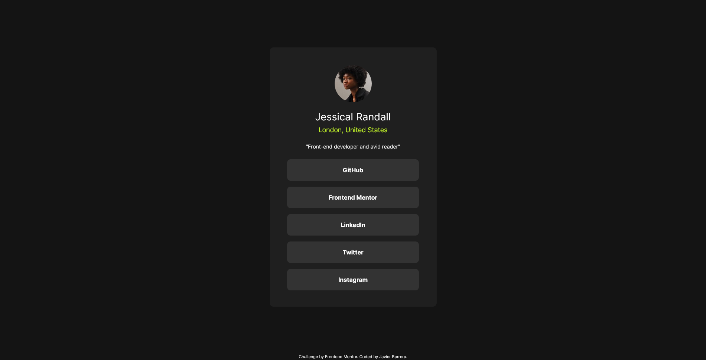

# Frontend Mentor - Social links profile solution

This is a solution to the [Social links profile challenge on Frontend Mentor](https://www.frontendmentor.io/challenges/social-links-profile-UG32l9m6dQ). Frontend Mentor challenges help you improve your coding skills by building realistic projects. 

## Table of contents

- [Overview](#overview)
  - [The challenge](#the-challenge)
  - [Screenshot](#screenshot)
  - [Links](#links)
- [My process](#my-process)
  - [Built with](#built-with)
  - [What I learned](#what-i-learned)
  - [Useful resources](#useful-resources)
- [Author](#author)

## Overview

### The challenge

Users should be able to:

- See hover and focus states for all interactive elements on the page

### Screenshot

### Links

- Solution URL: [https://github.com/javierb256/Social-Links-Profile](https://github.com/javierb256/Social-Links-Profile)
- Live Site URL: [https://javierb256.github.io/Social-Links-Profile/](https://javierb256.github.io/Social-Links-Profile/)

## My process

### Built with

- Semantic HTML5 markup
- CSS custom properties
- Flexbox
- Bootstrap

### What I learned

For this project I wanted to become familiar with bootstrap so that was the css framework that I decided to use. I did struggle in the beginning getting used to bootstrap's pre made classes and stylings, but whenever I would get stuck I would refer to the bootstrap documentation as well as look for guides online and video tutorials on youtube. Overall I am happy with what I built and I hope to become more familiar with bootstrap in the future.

### Useful resources

- [Bootstrap documentation](https://getbootstrap.com/) - Bootstrap documentation

## Author

- Website - [javierbarrera.dev](https://javierbarrera.dev/)
- Frontend Mentor - [@javierb256](https://www.frontendmentor.io/profile/javierb256)
